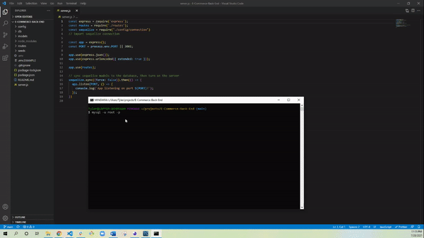

# E-Commerce-Back-End

- [E-Commerce-Back-End](#e-commerce-back-end)
  - [Description](#description)
  - [Installation](#installation)
  - [Usage](#usage)
  - [Review Links](#review-links)
  - [Questions](#questions)
  - [Demo gif](#demo-gif)
  - [License](#license)

## Description
AS A manager at an internet retail company  
I WANT a back end for my e-commerce website that uses the latest technologies  
SO THAT my company can compete with other e-commerce companies

## Installation
For this application the user will need mySQL a terminal, and insomnia.

## Usage
* First thing you need to do is run "npm i" in the terminal to install the packages needed to run this application
* After that you need to create the database in mySQL by running "mysql -u (USERNAME) -p" then enter your mySQL password when prompted. After that run "CREATE DATABASE ecommerce_db;" you should see this message after you create the database "Query OK, 1 row affected (0.01 sec)" when that is done type QUIT to exit mySQL in the terminal. 
* When the database is created you need create a .env file to store your mySQL username, database name, and password(use the .env.EXAMPLE file for a reference)
* Next you need to seed the database by running "npm run seed" in that terminal  
* Then you can run "npm start" in the terminal to run the server.
* Once the server is running you can open insomnia and begin testing the CRUD routes for Category, Product, and Tag.

## Review Links
[Repository](https://github.com/Twdavis85/E-Commerce-Back-End) &nbsp; | &nbsp; 
[Demo](https://drive.google.com/file/d/14-gfBzc0jLuSdzVqswrYKGz_UYblwFUO/view?usp=sharing)

## Questions
To check out my work and follow me on GitHub visit: [Twdavis85](https://github.com/Twdavis85)  
If you have any questions about this or any other project feel free to email me at: [tdnc85@yahoo.com](mailto:tdnc85@yahoo.com)

## Demo gif

## License
Copyright 2021 &ensp; Tyler Davis

    Permission is hereby granted, free of charge, to any person obtaining
    a copy of this software and associated documentation files (the "Software"),
    to deal in the Software without restriction, including without limitation
    the rights to use, copy, modify, merge, publish, distribute, sublicense,
    and/or sell copies of the Software, and to permit persons to whom the
    Software is furnished to do so, subject to the following conditions:
    
    The above copyright notice and this permission notice shall be included
    in all copies or substantial portions of the Software.
    
    THE SOFTWARE IS PROVIDED "AS IS", WITHOUT WARRANTY OF ANY KIND, 
    EXPRESS OR IMPLIED, INCLUDING BUT NOT LIMITED TO THE WARRANTIES 
    OF MERCHANTABILITY, FITNESS FOR A PARTICULAR PURPOSE AND NONINFRINGEMENT. 
    IN NO EVENT SHALL THE AUTHORS OR COPYRIGHT HOLDERS BE LIABLE FOR ANY 
    CLAIM, DAMAGES OR OTHER LIABILITY, WHETHER IN AN ACTION OF CONTRACT, 
    TORT OR OTHERWISE, ARISING FROM, OUT OF OR IN CONNECTION WITH THE SOFTWARE 
    OR THE USE OR OTHER DEALINGS IN THE SOFTWARE.